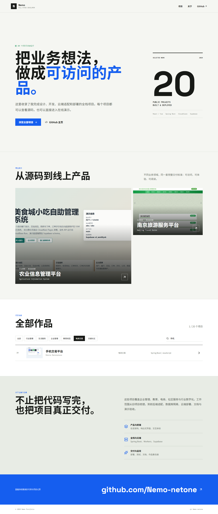

# Nemo 个人作品集


集中展示 20 个已部署全栈项目的个人作品集，包含真实截图、功能介绍、技术栈、GitHub 仓库和在线演示入口。

- 在线演示：https://o-personal-portfolio.pages.dev
- GitHub：https://github.com/Nemo-netone/o-personal-portfolio



## 核心功能

- 精选项目视觉展示
- 20 个项目完整档案
- 业务领域分类筛选
- 项目名称和技术栈搜索
- 项目详情弹窗
- GitHub 与在线演示直达
- 桌面端与移动端响应式布局

## 技术栈

- React 19
- TypeScript
- Vite 6
- Lucide Icons
- 原生 CSS
- Cloudflare Pages

## 项目结构

```text
src/
├─ components/       页面组件
├─ data.ts           20 个项目的结构化资料
├─ App.tsx           页面状态与数据流
└─ App.css           完整响应式视觉样式
public/projects/     项目真实截图
docs/                功能、部署、账号和验收截图
```

## 本地运行

```bash
npm install
npm run dev
```

## 验证

```bash
npm run lint
npm run build
```

已通过 Playwright 桌面端和移动端验收，包括 20 个项目渲染、筛选、搜索、详情弹窗、外链和横向溢出检查。

## 文档

- [功能说明](docs/features.md)
- [部署说明](docs/deployment.md)
- [账号说明](docs/accounts.md)

## 许可证

本项目采用 PolyForm Noncommercial License 1.0.0。允许非商业使用和修改；商业使用需要获得作者单独许可。
